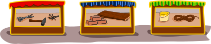

## Body

Bella aimerait construire un pont par-dessus un ruisseau. Elle a besoin d'un marteau, de clous, de planches et d'une corde. Elle trouve un marteau et une corde à la cave.

Elle doit acheter les autres objets. En bas, tu vois trois magasins et ce qu'ils vendent.

## Question/Challenge - for the brochures

Dans quels magasins Bella peut-elle acheter les autres objets?

## Question/Challenge - for the online challenge

Dans quels magasins Bella peut-elle acheter les autres objets? Clique sur les bons magasins pour les sélectionner; clique à nouveau pour les désélectionner.

## Answer Options/Interactivity Description

<!-- empty -->

:::comment 
Durch Anklicken wechselt jedes Geschäft den Status zwischen "ausgewählt" und "nicht ausgewählt". Zu Beginn sind alle Geschäfte "nicht ausgewählt". Ein "ausgewähltes" Geschäft wird grafisch hervorgehoben.
:::

## Answer Explanation

La bonne réponse est:

## It's Informatics

Dans cet exercice, les magasins vendent en tout sept ojects différents: des ciseaux, un marteau, des clous, des briques, des planches, une corde et un seau. C'est un grand ensemble d'objets! Les objets que Bella doit acheter sont une _partie de cet ensemble_. On peut le représenter de la façon suivante: on montre tous les objets de l'ensemble complet et note pour chaque objet s'il appartient au sous-ensemble que Bella doit acheter ou pas:

De la même manière, on peut représenter quels objets sont vendus dans les magasins, par exemple dans le magasin de gauche:

On voit ainsi au premier coup d'œil ce que Bella peut acheter dans le magasin de gauche: Les clous sont marqué d'une coche verte dans le sous-ensemble de Bella et dans le sous-ensemble du magasin.

Les programmes informatiques doivent aussi souvent comparer des ensembles. Pour chaque objet pouvant être présent, on a besoin d'un _bit_. Un ordinateur peut enregistrer une de deux valeurs dans un bit, comme par exemple "oui" ou "non". Dans notre cas, on enregistre si un objet appartient à un ensemble ("oui") ou pas ("non"). Un programme peut ensuite comparer deux ensembles de la façon suivante: il vérifie si le bit correspondant à un objet vaut "oui" dans un ensemble et vaut aussi "oui" dans l'autre ensemble. Une telle comparaison de deux bits est très rapide pour un ordinateur. C'est pour cela qu'en informatique, les ensembles sont souvent décrits en utilisant des bits.

## Keywords and Websites

 - Ensemble: https://fr.wikipedia.org/wiki/Ensemble_(informatique)
 - Bits: https://fr.wikipedia.org/wiki/Bit
 - Tableau de bits: https://fr.wikipedia.org/wiki/Tableau_de_bits

## Wording and Phrases

(Not reported from original file)

## Comments

(Not reported from original file)
