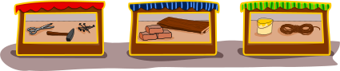

## Body

Bella vuole costruire un ponte su un ruscello.
Per farlo ha bisogno di un martello, chiodi, tavole e una corda. 
Fortunatamente trova un martello e una corda nella cantina.

Deve però comprare gli altri materiali.
Qui sotto puoi vedere tre negozi e quello che vendono.

## Question/Challenge - for the brochures

Dove può Bella comprare le altre cose?

## Question/Challenge - for the online challenge

Dove può Bella comprare le altre cose? Clicca sui negozi giusti. Clicca di nuovo per deselezionarli.

## Answer Options/Interactivity Description

<!-- empty -->

:::comment 
Durch Anklicken wechselt jedes Geschäft den Status zwischen "ausgewählt" und "nicht ausgewählt". Zu Beginn sind alle Geschäfte "nicht ausgewählt". Ein "ausgewähltes" Geschäft wird grafisch hervorgehoben.
:::

## Answer Explanation

Questo è corretto:

## It's Informatics

I negozi di questo compito vendono un totale di sette cose: forbici, martelli, chiodi, mattoni, assi, corde e secchi. È un bel po' di roba! Le due cose che Bella deve comprare sono un _sottoinsieme_.  Si può disegnare così: si mostrano tutte le cose dell'insieme e si segna per ogni cosa se appartiene o no al sottoinsieme della spesa di Bella: 

Allo stesso modo, si può dipingere ciò che i negozi vendono, per esempio il negozio sulla sinistra:

In questo modo puoi vedere a prima vista cosa Bella può comprare nel negozio sulla sinistra: i chiodi hanno un segno di spunta verde nel sottoinsieme di acquisto e nel sottoinsieme di vendita.

Anche i programmi informatici devono spesso confrontare degli _insiemi_ (_set_ in inglese). Possono farlo come mostrato sopra: per ogni cosa che può accadere, è necessario un _bit_. In un bit, un computer può memorizzare uno dei due valori, come "sì" e "no". In questo caso, memorizza se questa cosa appartiene a un insieme ("sì") oppure non vi appartiene ("no"). Poi un programma può confrontare due insiemi nella seguente maniera: controlla se il bit per una cosa in un insieme è "sì" e il bit per la stessa cosa nell'altro set è anch'esso "sì". Un computer può eseguire un tale controllo di due bit in modo particolarmente rapido. Nell'informatica, la descrizione degli insiemi con i bit è quindi molto comune.

## Keywords and Websites

 - Set: https://it.wikipedia.org/wiki/Set_(informatica)
 - Bits: https://it.wikipedia.org/wiki/Bit

## Wording and Phrases

(Not reported from original file)

## Comments

(Not reported from original file)
