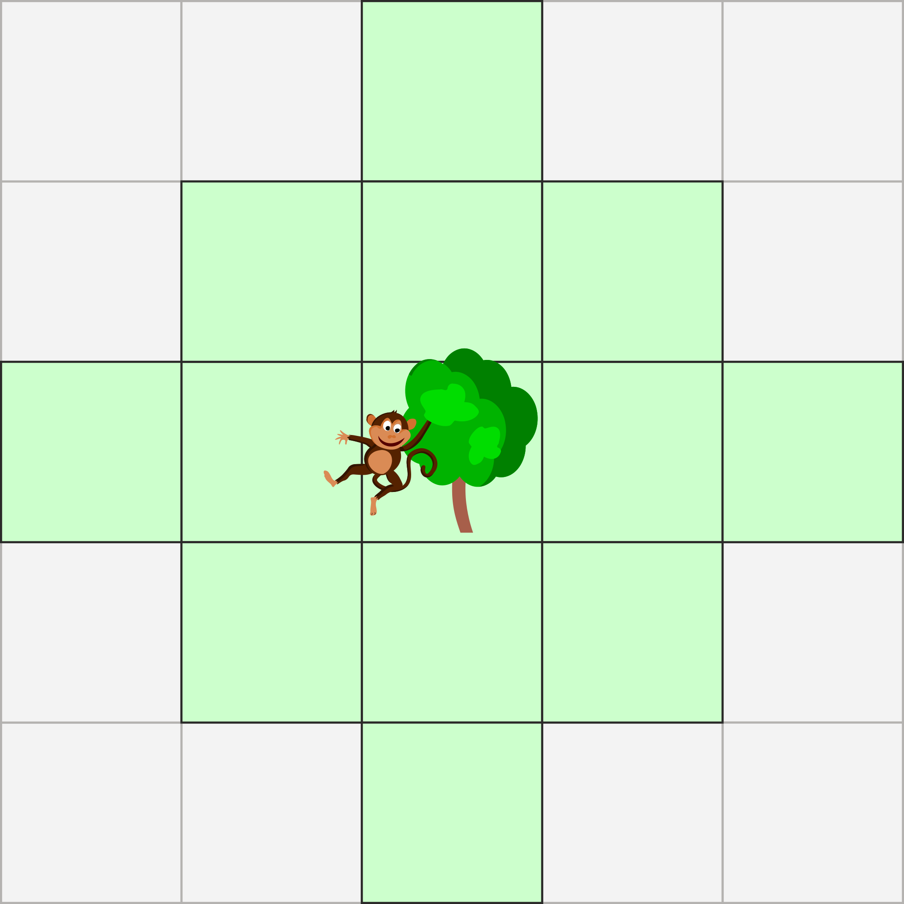
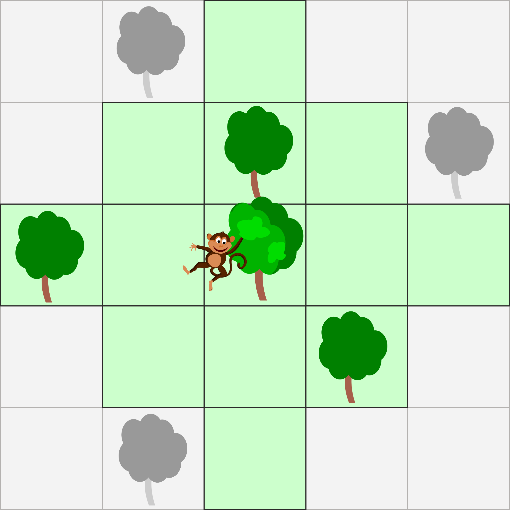
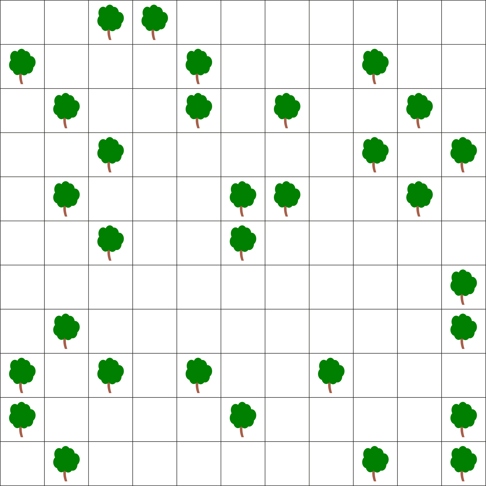
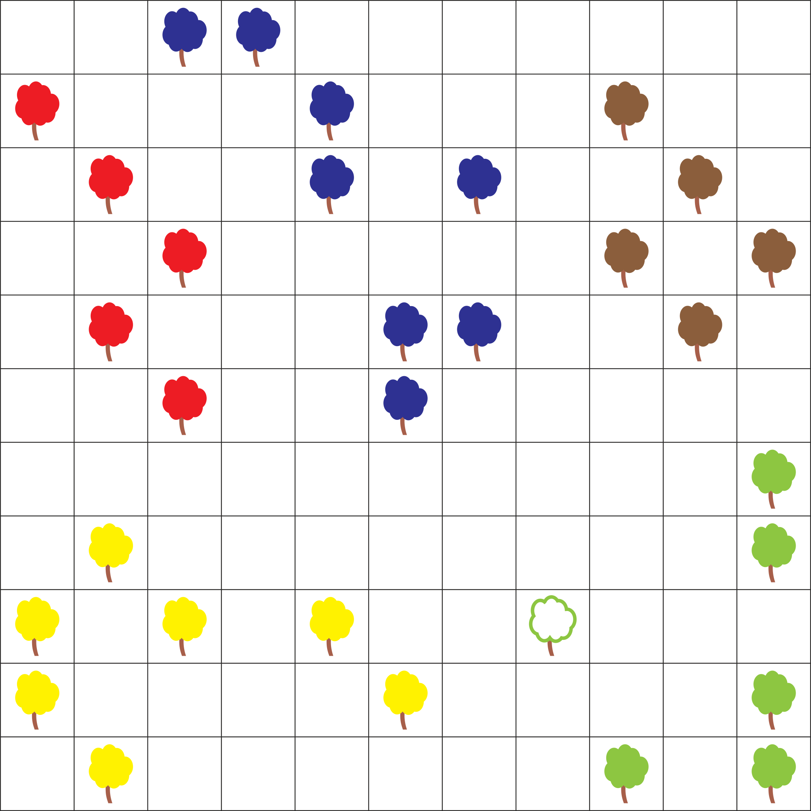
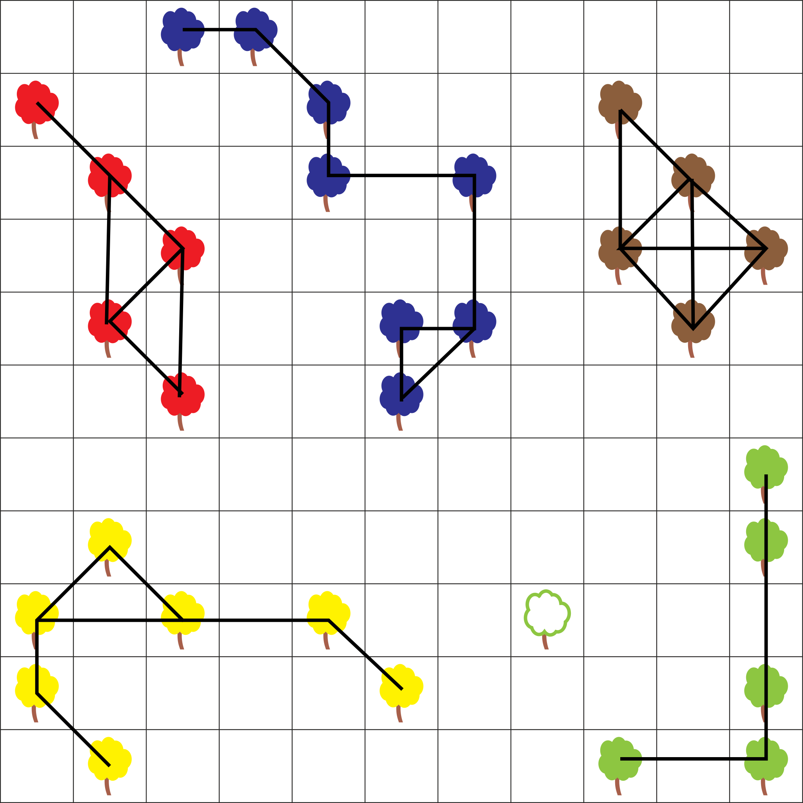

## Body

:--+ | :--
Kletteräffchen Koko kann von einem Baum so weit springen, wie es der grüne Bereich | 
In folgendem Beispiel erreicht Koko die farbigen Bäume mit einem Sprung. Mit zwei Sprüngen sind auch die beiden grauen Bäume oben erreichbar, nicht aber der graue Baum unten. | 

Es gibt Gruppen von Bäumen, zwischen denen sich Koko mit mehreren Sprüngen beliebig bewegen kann, ohne jemals den Boden zu berühren.

## Question/Challenge - for the brochures

Markiere alle Bäume der grössten solchen Gruppe.

## Question/Challenge - for the online challenge

Markiere alle Bäume der grössten solchen Gruppe. Klicke auf die Bäume. Klicke noch einmal, um sie wieder abzuwählen.

## Answer Options/Interactivity Description

<!-- empty -->

:::comment
Markiere Bäume durch Anklicken. Erneutes Klicken löscht die Markierung. «Zurücksetzen» löscht alle Markierungen.
:::

## Answer Explanation

Im Bild unten haben zwei Bäume dieselbe Farbe, wenn Koko vom einen zum anderen gelangen kann, ohne den Boden zu berühren. 

Wir sehen, dass die blaue Baumgruppe mit ihren acht Bäumen die grösste ist. 

## It's Informatics

Wenn Koko von einem Baum direkt zum nächsten springen kann, sind sie quasi miteinander verbunden. Wir können dies als eine Linie zwischen den Bäumen darstellen, so wie unten gezeigt. Wir haben also einen Graphen mit Bäumen als Knoten und Kanten zwischen verbundenen Bäumen. Koko kann genau dann springend von einem Baum zu einem anderen gelangen, wenn die Kanten einen Weg zwischen den beiden Bäumen bilden. 

Wir nennen eine Gruppe von Knoten _zusammenhängend_, wenn sie alle über Kanten miteinander verbunden sind. Wenn wir eine solche Gruppe nicht mehr grösser machen können, ohne den Zusammenhang zwischen ihnen zu verlieren, dann sprechen wir von einer _Zusammenhangskomponente_. Ein Graph lässt sich eindeutig in solche Zusammenhangskomponenten aufteilen, unten sind sie farbig markiert.

Eine Zusammenhangskomponente lässt sich einfach bestimmen, indem man bei einem beliebigen Knoten beginnt und dann alle über Kanten erreichbaren Knoten sucht.

## Keywords and Websites

 - Zusammenhangskomponenten, https://de.wikipedia.org/wiki/Zusammenhang_(Graphentheorie)

## Wording and Phrases

verbunden: Benachbart im graphentheoretischen Sinne. zusammenhängend
Zusammenhangskomponente

## Comments

(Not reported from original file)
