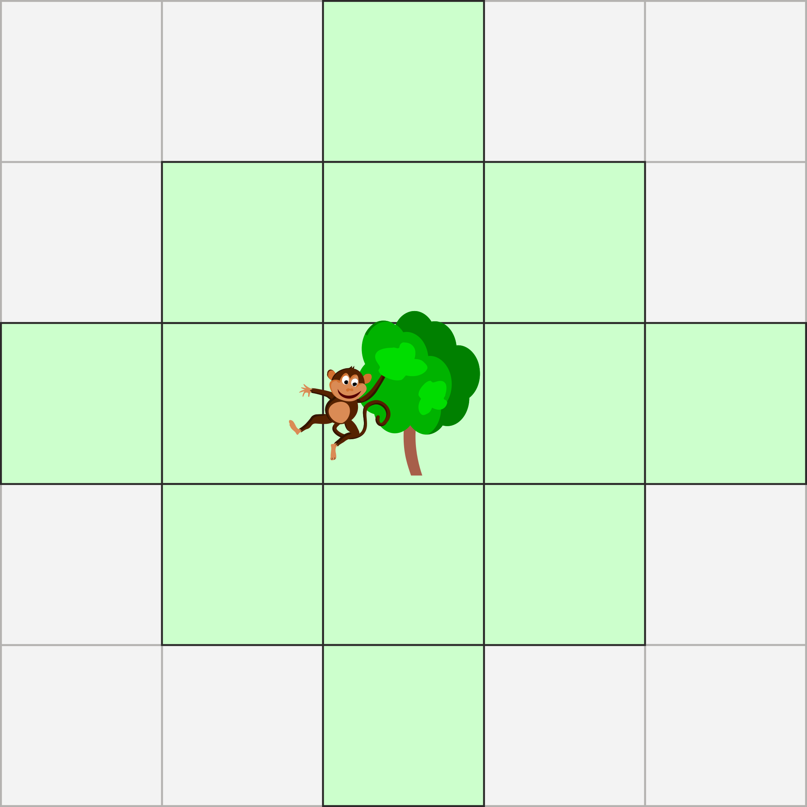
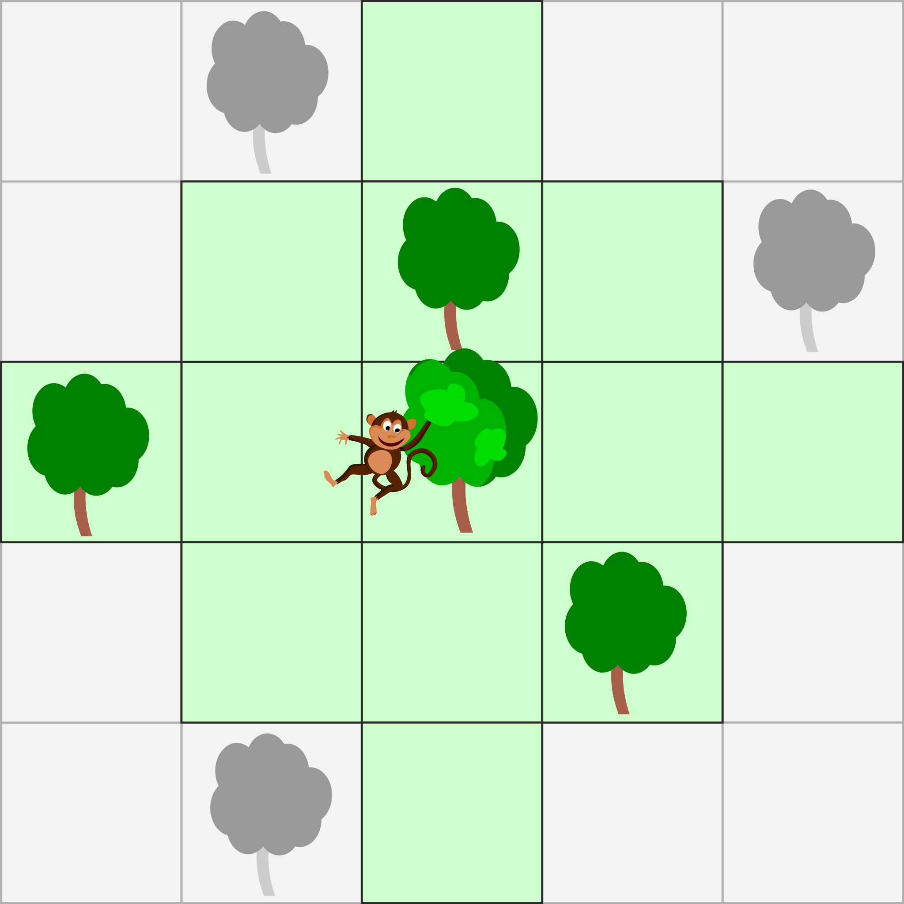

## Body

:--+ | :--
Coco le petit singe peut sauter depuis un arbre aussi loin que le montre le domaine coloré en vert. | 
Dans l'exemple suivant, Coco peut atteindre les arbres en couleur d'un seul saut. En deux sauts, il peut aussi atteindre les deux arbres gris du haut, mais pas l'arbre gris du bas. | 

Il existe des groupes d'arbres dans lequels Coco peut se déplacer sans toucher le sol une seule fois.

## Question/Challenge - for the brochures

Sélectionne tous les arbres du plus grand de ces groupes.

## Question/Challenge - for the online challenge

Clique sur tous les arbres du plus grand de ces groupes. <!--SD:please add>Klicke noch einmal, um sie wieder abzuwählen.</-->

## Answer Options/Interactivity Description

<!-- empty -->

:::comment
Markiere Bäume durch Anklicken. Erneutes Klicken löscht die Markierung. «Zurücksetzen» löscht alle Markierungen.
:::

## Answer Explanation

Sur l'image ci-dessous, deux arbres ont la même couleur si Coco peut passer de l'un à l'autre sans toucher le sol.

On voit que le groupe d'arbres bleus comptant huit arbres est le plus grand des groupes.

## It's Informatics

Si Coco peut sauter directement d'un arbre à l'autre, ils sont pour ainsi dire connectés l'un à l'autre. On peut représenter cela à l'aide d'un ligne entre les arbres comme montré plus bas. On obtient donc un graphe dont les arbres sont les nœuds avec des arêtes entre les arbres connectés. Coco peut passer d'un arbre à l'autre en sautant seulemnt s'il existe un chemin le long des arêtes menant d'un arbre à l'autre.

On appelle un groupe de nœuds _connexe_ si tous les nœuds sont connectés ensemble par des arêtes. Lorsqu'un tel groupe ne peut plus être agrandi sans perdre la connection entre les nœuds, on parle d'une _composante connexe_. Un graphe peut être divisé de manière unique en composantes connexes; elles sont colorées sur l'image ci-dessous.

On peut faciliement identifier une composante connexe en partant d'un nœud quelconque puis en cherchant tous les nœuds accessibles par des arêtes. 

## Keywords and Websites

 - Graphe connexe: https://fr.wikipedia.org/wiki/Graphe_connexe

## Wording and Phrases

verbunden: Benachbart im graphentheoretischen Sinne. zusammenhängend
Zusammenhangskomponente

## Comments

(Not reported from original file)
