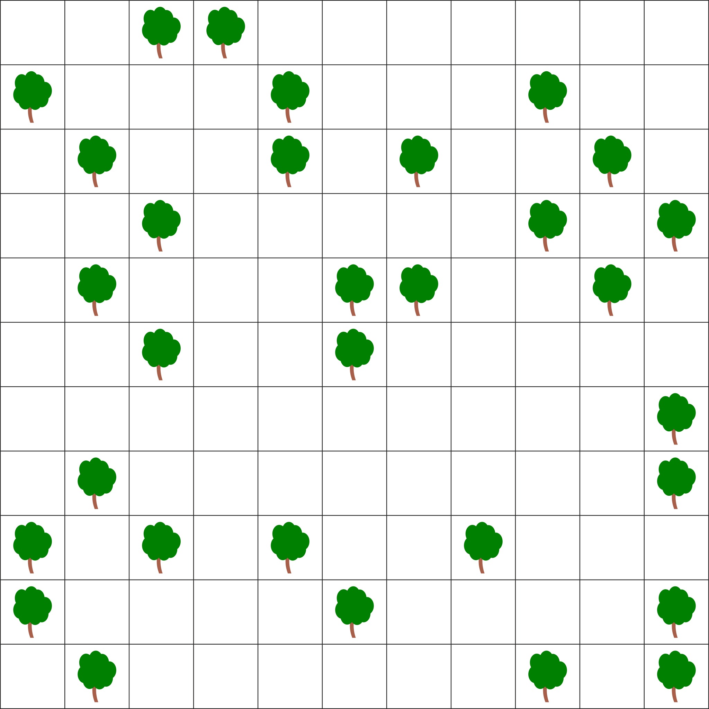

## Body

:--+ | :--
La scimmia arrampicatrice Coco può saltare da un albero e raggiungere qualsiasi luogo nell'area verde. | 
Nell'esempio seguente, Coco raggiunge gli alberi verdi con un solo salto. Con due salti, può raggiungere anche i due alberi grigi sopra, ma non l'albero grigio sotto. | 

Ci sono gruppi di alberi tra i quali Coco può muoversi a volontà con diversi salti senza mai toccare il suolo.

## Question/Challenge - for the brochures

Segna tutti gli alberi del gruppo più grande in cui questo è possibile.

## Question/Challenge - for the online challenge

Segna tutti gli alberi del gruppo più grande in cui questo è possibile. Clicca sugli alberi. Clicca di nuovo per deselezionarli.

## Answer Options/Interactivity Description

<!-- empty -->

:::comment
Markiere Bäume durch Anklicken. Erneutes Klicken löscht die Markierung. «Zurücksetzen» löscht alle Markierungen.
:::

## Answer Explanation

Nell'immagine qui sotto, due alberi sono dello stesso colore se Coco può passare da uno all'altro senza toccare il suolo. 

Vediamo che il gruppo di alberi blu con i suoi otto alberi è il più grande. 

## It's Informatics

Se Coco può saltare direttamente da un albero all'altro, sono virtualmente collegati. Possiamo rappresentare il salto come una linea tra gli alberi, come mostrato qui sotto. Così abbiamo un grafo con alberi come vertici e archi tra alberi collegati. Coco può saltare da un albero all'altro esattamente quando gli archi formano un percorso tra i due alberi. 

Chiamiamo un gruppo di vertici _connessi_ se sono tutti collegati da archi. Se non possiamo ingrandire tale gruppo senza perdere la connessione tra loro, allora parliamo di una _componente fortmente connessa_. Un grafico può essere chiaramente diviso in tale componenti fortemente connesse, qui sotto sono segnate con vari colori.

Una componente fortemente connessa può essere facilmente determinata iniziando da qualsiasi nodo e poi cercando tutti i nodi che possono essere raggiunti attraverso gli archi.

## Keywords and Websites

 - Grafo conesso, https://it.wikipedia.org/wiki/Grafo_connesso
 - Componente fortemente connessa, https://it.wikipedia.org/wiki/Componente_fortemente_connessa

## Wording and Phrases

verbunden: Benachbart im graphentheoretischen Sinne. zusammenhängend
Zusammenhangskomponente

## Comments

(Not reported from original file)
