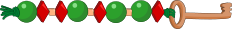

## Body

ANNA, BELLA et LENA font des porte-clés avec leur nom. Elles utilisent deux sortes de perles pour les lettres: ![ball] et ![diamond]. Différentes lettres sont séparées par la perle ![cubew] .

:---: | --+
ANNA  | 
BELLA | 

[ball]:    graphics/2021-SK-01-beadround.svg "boule (20px)"
[diamond]: graphics/2021-SK-01-beaddiamond.svg "diamant (20px)"
[cubew]:   graphics/2021-SK-01-beadsquare-withoutwhitespace.svg "cube (10px inline(+0.5ex))"
[cube]:    graphics/2021-SK-01-beadsquare.svg "cube (8px inline(+0.8ex))"

## Question/Challenge - for the brochures

Quel porte-clés LENA a-t-elle fait?

## Question/Challenge - for the online challenge

Quel porte-clés LENA a-t-elle fait?

## Answer Options/Interactivity Description

--: | :-----+
 A) | ![ansA]
 B) | ![ansB]
 C) | ![ansC]
 D) | ![ansD]

[ansA]: graphics/2021-SK-01-answerA.svg "réponse A"
[ansB]: graphics/2021-SK-01-answerB.svg "réponse B"
[ansC]: graphics/2021-SK-01-answerC.svg "réponse C"
[ansD]: graphics/2021-SK-01-answerD.svg "réponse D"

## Answer Explanation

La bonne réponse est A) )").

Le mot LENA commence par un L. La lettre L est la troisième et quatrième lettre du mot BELLA, on peut donc reconnaître la suite de perles  utilisée pour la lettre L dans BELLA: ![letterL]. Seules les réponses A et D) commencent par cette lettre et peuvent être la solution. La deuxième lettre de Lena, le E, est aussi la deuxième lettre de BELLA, on peut trouve donc la perle ![letterE] dans les deux porte-clés. Les réponses A) et D) ont les deux la perle ![letterE] comme deuxième lettre, les deux peuvent donc toujours être la solution. On veut ensuite trouver quelles perles sont utilisées pour la lettre N. On trouve la suite de perles ![letterN] dans le porte-clé d'ANNA. On ne trouve ces perles pour la lettre suivante que dans la réponse A).

Une autre possibilité pour trouver quelles perles sont utilisées pour le porte-clés de LENA est de faire un tableau montrant les perles correpondant aux lettres connues. Le porte-clés d'ANNA nous donne la suite de perles ![letterA] pour la lettre A et la suite de perles ![letterN] pour la lettre N. Le porte-clés de BELLA nous donne la suite de perles pour B: ![letterB], pour E: ![letterE] et pour L: ![letterL].

:::center
 Lettres   | Perles
:--------: | :----------------:
    A      | ![letterA]
    N      | ![letterN]
    B      | ![letterB]
    E      | ![letterE]
    L      | ![letterL]
:::

[letterA]: graphics/2021-SK-01-letterA.svg "Buchstabe A (35px)"
[letterB]: graphics/2021-SK-01-letterB.svg "Buchstabe B (79px)"
[letterL]: graphics/2021-SK-01-letterL.svg "Buchstabe L (79px)"
[letterN]: graphics/2021-SK-01-letterN.svg "Buchstabe N (35px)"
[letterE]: graphics/2021-SK-01-beadround.svg "Buchstabe E (20px)"

On peut donc faire le porte-clés de LENA avec les suites de perles ![letterL], ![letterE], ![letterN] et ![letterA] si on sépare les difféerentes lettres avec la perle ![cubew] . On obtient le porte-clés "), ce qui correspond à la réponse A). Si l'on décode les autres porte-clés à l'aide du tableau, on trouve BENA pour B), NENA pour C) et LEAN pour D).

## It's Informatics

L'information est _encodée_ pour pouvoir transférer des messages sous certaines conditions ou pour transmettre des informations de manière secrète (_chiffrée_). Le codage de cet exercice est basé sur l'alphabet Morse. le point ![dot] de l'alphabet Morse est représenté par la perle ronde ![ball] et le trait ![dash] par ![diamond]. La lettre A s'écrit ![dot]&nbsp;![dash] en alphabet Morse, donc ![letterA] en perles. Pour encoder des textes quelconques, il faut un code pour chaque lettre de l'alphabet.

L'alphabet Morse a été créé au XIX^e^ siècle. Samuel Morse inventa un télégraphe électromagnétique simple en 1837. Le code utilisé à l'époque ne comprenait que les dix chiffres de 0 à 9; les chiffres transmis devaient être traduits en lettres puis en mots à l'aide d'une tableau. Albert Lewis Vail, un collègue de Morse, developpa dès 1838 le premier code comprenant aussi des lettres. Le code fut développé pour pouvoir transmettre des textes par voie acoustique, optique ou électromagnétique à l'aide d'un télégraphe. Un point représente une courte durée de transmission et un trait une durée trois fois plus longue. Un pause sépare les lettres, et une pause plus longue sépare les mots. L'alphabet Morse est encore utilisé aujourd'hui pour le signal SOS. Un SOS en Morse ![dot]&nbsp;![dot]&nbsp;![dot]&nbsp;![dash]&nbsp;![dash]&nbsp;![dash]&nbsp;![dot]&nbsp;![dot]&nbsp;![dot]&nbsp; (3x court, 3x long, 3x court) peut être transmis facilement en criant, tapant ou avec une lampe de poche. 

Dans le traitement de données informatiques, les caractères sont encodés par des valeurs numériques pour être transmis ou enregistrés.

[dot]:  graphics/2021-SK-01_morseDot.svg  "point Morse (5px inline(+0.7ex))"
[dash]: graphics/2021-SK-01_morseDash.svg "trait Morse (10px inline(+0.7ex))"

## Keywords and Websites

 - Codage des caractères: https://fr.wikipedia.org/wiki/Codage_des_caractères
 - Alphabet Morse: https://fr.wikipedia.org/wiki/Code_Morse_international

## Wording and Phrases

(Not reported from original file)

## Comments

(Not reported from original file)
