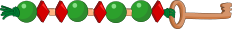

## Body

ANNA, BELLA e LENA hanno costruito dei portachiavi con i loro nomi. Hanno usato due tipi di perline per le lettere: ![ball] e ![diamond]. Separano le lettere individuali con questa perlina: ![cubew] .

:---: | --+
ANNA  | 
BELLA | 

[ball]:    graphics/2021-SK-01-beadround.svg "pallina (20px)"
[diamond]: graphics/2021-SK-01-beaddiamond.svg "diamante (20px)"
[cubew]:   graphics/2021-SK-01-beadsquare-withoutwhitespace.svg "cubo (10px inline(+0.5ex))"
[cube]:    graphics/2021-SK-01-beadsquare.svg "cubo (8px inline(+0.8ex))"

## Question/Challenge - for the brochures

Quale portachiavi ha fatto LENA?

## Question/Challenge - for the online challenge

Quale portachiavi ha fatto LENA?

## Answer Options/Interactivity Description

--: | :-----+
 A) | ![ansA]
 B) | ![ansB]
 C) | ![ansC]
 D) | ![ansD]

[ansA]: graphics/2021-SK-01-answerA.svg "risposta A"
[ansB]: graphics/2021-SK-01-answerB.svg "risposta B"
[ansC]: graphics/2021-SK-01-answerC.svg "risposta C"
[ansD]: graphics/2021-SK-01-answerD.svg "risposta D"

## Answer Explanation

La risposta corretta è A) )").

La parola LENA inizia con L. In BELLA L è la terza e quarta lettera e riconosciamo in BELLA per L la sequenza di perline ![letterL]. Solo le risposte A) e D) iniziano con questa lettera e possono essere la soluzione. La seconda lettera di LENA, cioè E, è anche la seconda di BELLA, lì troviamo questa perlina ![ball]. Sia in A) che in D) abbiamo ![ball] come seconda lettera, quindi potrebbero ancora essere entrambi la soluzione corretta. In seguito vogliamo trovare le perline per la lettera N. Nel portachiavi di ANNA troviamo per N la sequenza di perline ![letterN]. E queste sono le sguenti perline solo nella soluzione A).

Un altro modo per trovare le perline per il portachiavi di LENA è fare una tabella con le perline per le lettere che già conosciamo. Dal portachiavi di ANNA troviamo per A la sequenza di perline ![letterA] e per N ![letterN]. Dal portachiavi di BELLA troviamo la sequenza di perline per B: ![letterB], per E: ![letterE] e per L: ![letterL]. 

:::center
Lettera | Perline
:-----: | :------------------:
   A    | ![letterA]
   N    | ![letterN]
   B    | ![letterB]
   E    | ![letterE]
   L    | ![letterL]
:::
[letterA]: graphics/2021-SK-01-letterA.svg "Buchstabe A (35px)"
[letterB]: graphics/2021-SK-01-letterB.svg "Buchstabe B (79px)"
[letterL]: graphics/2021-SK-01-letterL.svg "Buchstabe L (79px)"
[letterN]: graphics/2021-SK-01-letterN.svg "Buchstabe N (35px)"
[letterE]: graphics/2021-SK-01-beadround.svg "Buchstabe E (20px)"

Quindi possiamo fare il portachiavi per LENA dalle perline ![letterL], ![letterE], ![letterN] e ![letterA], se separiamo ulteriormente le singole lettere con la perlina ![cubew]. Ecco come si ottiene questo portachiavi: "), che è la risposta A). Se decodifichiamo gli altri portachiavi dati usando la tabella di codifica, troviamo BENA per B), NENA per C) e LEAN per D).

## It's Informatics

L'informazione è _codificata_ per poter trasmettere messaggi in certe condizioni o per trasmettere l'informazione segretamente (_codificata_). In questo compito, la codifica è basata sul codice Morse. Il punto ![dot] del codice Morse è rappresentato dalla perlina rotonda ![ball] e la barra ![dash] da ![diamond]. La lettera A è in codice Morse ![dot]&nbsp;![dash],  quindi nel codice delle perline ![letterA]. Per codificare qualsiasi testo, abbiamo bisogno di codici per tutte le lettere dell'alfabeto. 

Il codice Morse ha avuto origine nel XIX secolo. Samuel Morse ha inventato un semplice telegrafo a scrittura elettromagnetica nel 1837. Il codice usato all'epoca comprendeva solo le dieci cifre da 0 a 9; i numeri trasmessi dovevano essere tradotti in lettere e parole con l'aiuto di una tabella. Alfred Lewis Vail, un impiegato di Morse, ha sviluppato il primo codice che includeva anche le lettere nel 1838. Il codice è stato sviluppato per trasmettere testi acusticamente, otticamente o elettricamente sulle linee telegrafiche. Un punto è un tempo di trasmissione breve e un trattino è tre volte più lungo. Ci deve essere una pausa tra le lettere. Una pausa più lunga separa le parole. Il codice Morse è usato ancora oggi per il segnale di soccorso SOS. SOS in codice Morse: ![dot]&nbsp;![dot]&nbsp;![dot]&nbsp;![dash]&nbsp;![dash]&nbsp;![dash]&nbsp;![dot]&nbsp;![dot]&nbsp;![dot]&nbsp; (3x breve, 3x lungo, 3x breve) può essere trasmesso molto facilmente urlando, bussando, o con una torcia. 

Nell'elaborazione elettronica dei dati, i caratteri sono codificati tramite un valore numerico per poterli trasmettere o memorizzare.

[dot]:  graphics/2021-SK-01_morseDot.svg  "Punto Morse (5px inline(+0.7ex))"
[dash]: graphics/2021-SK-01_morseDash.svg "Trattino Morse (10px inline(+0.7ex))"

## Keywords and Websites

 - Codifica di caretteri: https://it.wikipedia.org/wiki/Codifica_di_caratteri
 - Codice Morse: https://it.wikipedia.org/wiki/Codice_Morse

## Wording and Phrases

(Not reported from original file)

## Comments

(Not reported from original file)
