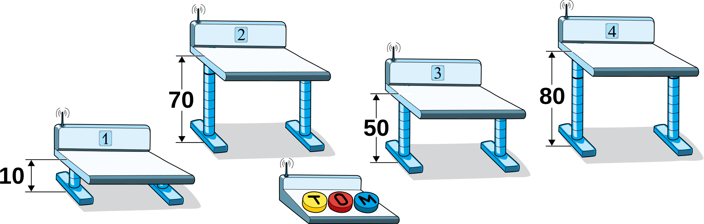

## Body

Im Schulzimmer hat es Pulte mit elektrisch einstellbarer Höhe. Für den Unterricht sollten alle Pulte auf die Höhe 60 cm eingestellt sein. Mit den Tasten ![T], ![O] und ![M] einer Fernbedienung kann die Höhe der Pulte verändert werden.
Jemand hat mit der Fernbedienung gespielt und sie umprogrammiert. Jetzt funktionieren die drei Tasten folgendermassen:
 - ![T] erhöht jedes der Pulte 1, 2 und 3 um jeweils 10 cm.
 - ![O] senkt jedes der Pulte 2, 3 und 4 um jeweils 10 cm.
 - ![M] erhöht jedes der Pulte 1, 3 und 4 um jeweils 10 cm.

Diese Aktionen werden jedes Mal ausgeführt, wenn die Taste gedrückt wird.

Momentan sind die Höhen der Pulte 1, 2, 3 und 4 auf 10 cm, 70 cm, 50 cm und 80 cm eingestellt:

 

[T]: graphics/2021-SV-01-buttonT.svg "Taste T"
[O]: graphics/2021-SV-01-buttonO.svg "Taste O"
[M]: graphics/2021-SV-01-buttonM.svg "Taste M"

## Question/Challenge - for the brochures

Wie kann die Höhe für alle vier Pulte auf 60 cm eingestellt werden?

## Question/Challenge - for the online challenge

Wie kann die Höhe für alle vier Pulte auf 60 cm eingestellt werden?

## Answer Options/Interactivity Description
--: | :-----+
 A) | Drücke 4 × ![T], 5 × ![O] und 1 × ![M].
 B) | Drücke 5 × ![T], 1 × ![O] und 0 × ![M].
 C) | Drücke 3 × ![T], 4 × ![O] und 2 × ![M].
 D) | Drücke 2 × ![T], 4 × ![O] und 6 × ![M].

## Answer Explanation

Die korrekte Antwort ist C) Drücke 3 × ![T] , 4 × ![O] und 2 × ![M].
Bei der Fernbedienung stellst du fest, dass alle drei Tasten mit jedem Mal Drücken die Höhe um 10 cm verändern, also immer um denselben Betrag. Zwei der Tasten lassen die Pulte höher werden (![T] und ![M]) und nur eine Taste senkt die Pulte ab (![O]). Zudem verändern alle drei Tasten die Höhe von jeweils drei Pulten, es bleibt also immer ein Pult, dessen Höhe unverändert bleibt. Die Taste ![O] hat keinen Einfluss auf Pult 1, wir können also Pult 1 gar nicht nach unten fahren. 

Pult 1 ist um 50 cm zu tief. Daraus schliessen wir, dass wir genau 5 Mal die Taste ![T] oder ![M] drücken müssen (die Anzahl der Tastendrücke auf ![T] und auf ![M] muss zusammengerechnet genau 5 sein). Das kann man als Gleichung ausdrücken: $T + M = 5$. Damit können wir Lösung D) ausschliessen, weil dort $T + M = 8$ gilt. Nach der Tastenfolge von Lösung D) hätte das Pult 1 die Höhe $10 + 20 + 60 = 90$ cm, nämlich die Ausgangshöhe $10$ cm plus $2 \cdot 10$ cm für ![T] plus $6 \cdot 10$ cm für ![M].

Pult 2 ist 10 cm zu hoch. ![M] hat keinen Einfluss auf Pult 2. Somit gilt für die richtige Lösung $T - O = -1$. Damit können wir die Lösung B) ausschliessen, denn damit hätte das Pult 2 am Ende die Höhe $70 + 50 - 10 = 110$.

Pult 3 ist 10 cm zu tief, also gilt: $T - O + M = 1$. Damit können die Lösungen A) und B) ausgeschlossen werden. Bei A) wäre die Höhe von Pult 3 am Ende wieder dieselbe, nämlich $50 + 40 - 50 + 10 = 50$ cm; bei B) wäre die Höhe von Pult 3 am Ende $50 + 50 - 10 = 90$ cm.
Nun sind alle Lösungen ausgeschlossen bis auf Lösung C).

Es muss aber noch geprüft werden, ob Lösung C) auch für Pult 4 die richtige Höhe ergibt. Pult 4 ist 20 cm zu hoch und ![T] hat keinen Einfluss auf die Höhe von Pult 4. Also muss zwei Mal ![O] gedrückt werden und für jedes Drücken von ![M] braucht es ein zusätzliches Drücken von ![O]. Mit der Tastenfolge von Lösung C) ist die Höhe von Pult 4 am Ende $80 - 40 + 20 = 60$ cm.

Da wir schon vorher für die Pulte 1, 2 und 3 festgestellt hatten, dass Lösung C) funktioniert, sind wir sicher, dass diese Lösung funktioniert.

Alternativ kann die Lösung mit vier linearen Gleichungen gesucht werden. Für jedes Pult schreibt man mit einer Gleichung auf, welche Tasten die Höhe des Pultes verändern und was die gesuchte Höhenveränderung ist. Beispielsweise verändert sich die Höhe von Pult 1 nur mit ![T] und ![M] und die gewünschte Höhenanpassung ist $50$ cm, was man mit 5 Tastendrücken erreichen kann (weil es pro Tastendruck $10$ cm sind).

Da es vier Pulte und drei Tasten sind, ergeben sich vier lineare Gleichungen mit drei Unbekannten:

-- | --+
$\begin{aligned} T + M &= 5 \\ T - O &= -1 \\ T - O + M &= 1 \\ - O + M &= -2 \end{aligned}$ | Wenn man die dritte Gleichung von der ersten abzieht, erhält man $O = 4$. Eingesetzt in die zweite Gleichung erhalten wir $T = 3$. Nur für $M = 2$ sind alle Gleichungen erfüllt. Somit ist es die einzige Lösung.

## It's Informatics

Dies ist eine typische Aufgabe aus dem Bereich der _diskreten Optimierung_, genauer spezifiziert, der _linearen Programmierung_. Diese Aufgabe ist gegeben durch eine Menge von Einschränkungen. In diesem Spezialfall kann man sie alle als lineare Gleichungen formulieren. Die Zielsetzung ist typisch für die Informatik. Man sucht eine Folge von Aktionen, die zu einem vorgegebenen Ziel führen. 
Man könnte sogar die ganze Aufgabe als die Suche nach einem Weg in einem vierdimensionalen Raum mit drei erlaubten Bewegungsaktionen beschreiben, nämlich vom Punkt $(10,70,50,80)$ zum Punkt $(60,60,60,60)$. 
In dieser Aufgabe gibt es nur eine Lösung, aber solche Aufgaben haben oft viele Lösungen, was eine Optimierung als Zielsetzung ermöglicht. Dann sucht man das Minimum der linearen Funktion $T + M + O$.

## Keywords and Websites

 - Diskrete Optimierung, ganzzahlige lineare Optimierung: https://de.wikipedia.org/wiki/Ganzzahlige_lineare_Optimierung 
 - Erreichbarkeit in gerichteten Konfigurationsgraphen: https://de.wikipedia.org/wiki/Erreichbarkeitsproblem_in_Graphen 

## Wording and Phrases

(Not reported from original file)

## Comments

(Not reported from original file)
