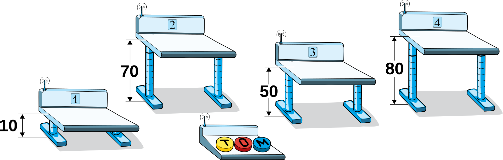

## Body

Dans la salle de classe, il y a des pupitres dont la hauteur est réglable électriquement. Tous les pupitres doivent être réglés à 60 cm pour les cours. La hauteur peut être changée à l'aide des touches ![T], ![O] et ![M] d'une télécommande. Quelqu'un a joué avec la télécommande et l'a reprogrammée. Maintenant, les trois touches fonctionnent comme cela:
 - ![T] monte les pupitres 1, 2 et 3 de 10 cm chacun.
 - ![O] baisse les pupitres 2, 3 et 4 de 10 cm chacun.
 - ![M] monte les pupitres 1, 3 et 4 de 10 cm chacun.

Ces actions sont exécutées chaque fois que l'on appuie sur le bouton.

En ce moment, les hauteurs des pupitres 1, 2, 3 et 4 sont de à 10 cm, 70 cm, 50 cm et 80 cm:

[T]: graphics/2021-SV-01-buttonT.svg "touche T"
[O]: graphics/2021-SV-01-buttonO.svg "touche O"
[M]: graphics/2021-SV-01-buttonM.svg "touche M"

## Question/Challenge - for the brochures

Comment peut-on régler la hauteur des quatre pupitres à 60 cm?

## Question/Challenge - for the online challenge

Comment peut-on régler la hauteur des quatre pupitres à 60 cm?

## Answer Options/Interactivity Description
--: | :-----+
 A) | Appuie 4 × sur ![T], 5 × sur ![O] et 1 × sur ![M].
 B) | Appuie 5 × sur ![T], 1 × sur ![O] et 0 × sur ![M].
 C) | Appuie 3 × sur ![T], 4 × sur ![O] et 2 × sur ![M].
 D) | Appuie 2 × sur ![T], 4 × sur ![O] et 6 × sur ![M].

## Answer Explanation

La bonne réponse est C) Appuie 3 × sur ![T] , 4 × sur ![O] et 2 × sur ![M].

Tu peux constater que les trois touches de la télécommande changent la hauteur de 10 cm, donc toujours de la même distance. Deux des touches font monter les pupitres (![T] et ![M]) et seulement un touche les fait descendre (![O]). De plus, chacune des trois touches modifie la hauteur de trois pupitres; il y a donc toujours un pupitre dont la hauteur ne change pas. La touche ![O] n'a aucun effet sur le pupitre 1, on ne peut donc pas le faire descendre.

Le pupitre 1 est 50 cm trop bas. On peut en déduire que l'on doit appuyer exactement 5 fois sur les touches ![T] ou ![M] (la somme des nombres de fois où les touches ![T] et ![M] sont utilisées doit être égale à 5). On peut exprimer cela par l'équation $T + M = 5$. On peut donc éliminer la solution D), car $T + M = 8$ pour cette solution. D'après la suite de touches de la solution D), la pupitre 1 serait haut de $10 + 20 + 60 = 90$ cm, c'est à dire la hauteur de départ $10$ cm plus $2 \ast 10$ cm pour ![T] plus $6 \ast 10$ cm pour ![M].

le pupitre 2 est 10 cm trop haut. ![M] n'a pas d'effet sur le pupitre 2. La bonne solution doit donc satisfaire l'équation $T - O = -1$. On peut donc éliminer la solution B), car en l'utilisant, le pupitre 2 aurait à la fin une hauteur de $70 + 50 - 10 = 110$ cm.

Le pupitre 3 est 10 cm trop bas, ce qui donne l'équation $T - O + M = 1$. Les solutions A) et B) peuvent donc être éliminées. Avec la solution A), le pupitre aurait la même hauteur à la fin qu'au début: $50 + 40 - 50 + 10 = 50$ cm; avec la solution B, la hauteur du puptire serait $50 + 50 - 10 = 90$ cm. Toutes les solutions excepté la solution C) ont maintenant été éliminées.

Il faut encore vérifier que la solution C) met aussi le pupitre 4 à la bonne hauteur. Le pupitre 4 est 20 cm trop haut et la touche ![T] n'a aucun effet sur sa hauteur. Il faut donc appuyer deux fois sur ![O] et une fois de plus pour chaque fois que la touche ![M] est utilisée. La suite de touches de la solution C) donne la hauteur $80 - 40 + 20 = 60$ cm.

Comme on a déjà constaté plus haut que la solution C) permettait de mettre les pupitres 1, 2 et 3 à la bonne hauteur, on est maintenant sûr que cette solution fonctionne.

Un autre moyen de trouver la solution est de résoudre quatre équations linéaires. Pour chaque pupitre, on écrit une équation décrivant quelles touches changent sa hauteur et quelle est le changement de hauteur désiré. Par exemple, la hauteur du pupitre 1 ne change qu'avec les touches ![T] et ![M] et le changement désiré est de $50$ cm, ce que l'on peut obtenir en appuyant sur 5 touches (étant donné que pression sur une touche change la hauteur de $10$ cm).

Comme il y a quatre pupitres et trois touches, on obtient quatre équations linéaires avec trois inconnues:

-- | --+
$\begin{aligned} T + M &= 5 \\ T - O &= -1 \\ T - O + M &= 1 \\ - O + M &= -2 \end{aligned}$ | En soustrayant la troisième équation de la première, on obtient $O = 4$. en substituant dans la deuxièeme équation, on obtient $T = 3$. Toutes les équations sont résolues juste en prenant $M = 2$. C'est donc la seule bonne solution.

## It's Informatics

Cet exercice est un problème typique du domaine de l'_optimisation linéaire en nombres entiers_, aussi appelée _programmation linéaire en nombres entiers_. Le problème est donné par un certain nombre de contraintes. Dans ce cas particulier, on peut toutes les formuler sous la forme d'équations linéaires. L'optimisation est un but typique en informatique: on cherche une suite d'action permettant d'arriver à un but prédéfini.
On pourrait même décrire tout l'exercice par la recherche d'un chemin dans un espace quadridimensionnel avec trois déplacments possibles pour passer du point $(10,70,50,80)$ au point $(60,60,60,60)$. Cet exercice n'a qu'une solution, mais de tels problèmes ont souvent de multiples solutions, rendant l'optimisation possible. On cherche alors le minimum de la fonction linéaire $T + M + O$.

## Keywords and Websites

 - Optimisation linéaire en nombres entiers: https://fr.wikipedia.org/wiki/Optimisation_linéaire_en_nombres_entiers

## Wording and Phrases

(Not reported from original file)

## Comments

(Not reported from original file)
