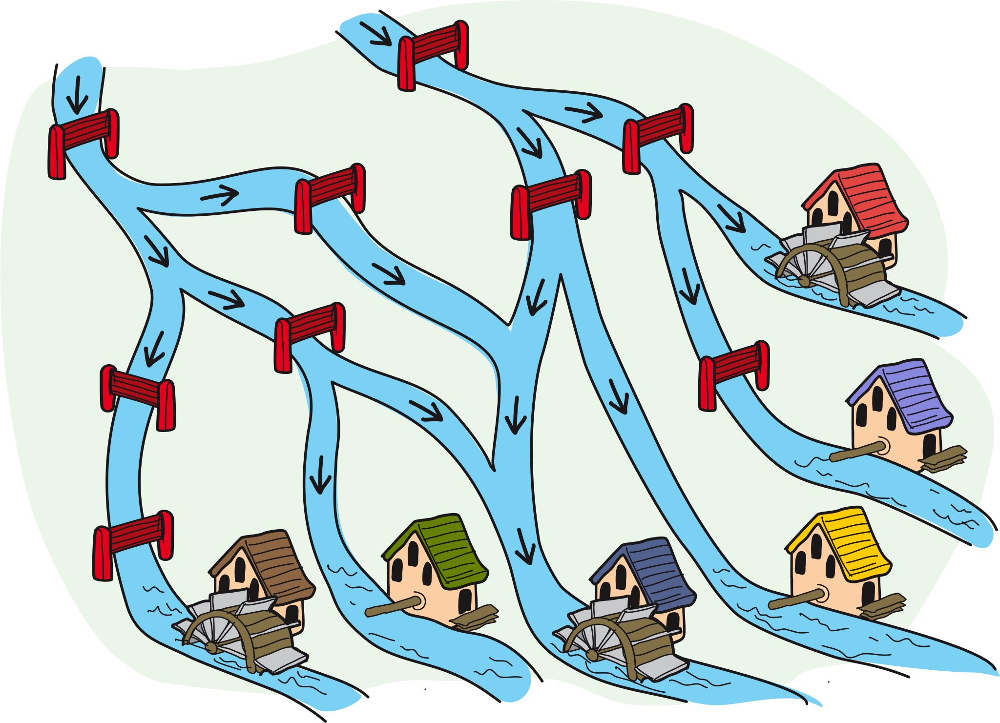
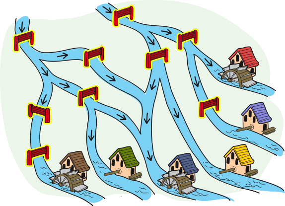
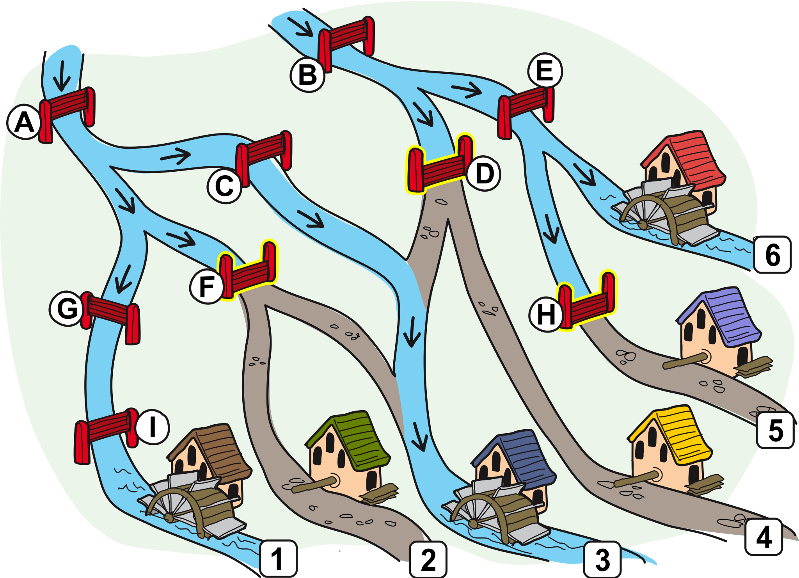

## Body

Müller Mert hat sechs Mühlen. 
Bei drei davon muss er noch das Mühlrad einbauen. 
Dafür darf kein Wasser mehr zu diesen Mühlen fliessen. 
Zu den anderen Mühlen soll aber weiterhin Wasser fliessen.

Das Wasser kann nur nach unten fliessen. 
Ein geschlossener Schieber stoppt das Wasser.

## Question/Challenge - for the brochures

Welche Schieber soll Mert schliessen?

## Question/Challenge - for the online challenge

Welche Schieber soll der Müller schliessen?
Klicke die Schieber an, um sie auszuwählen.
Klicke noch einmal, um einen Schieber wieder abzuwählen.

## Answer Options/Interactivity Description

<!-- empty -->

:::comment
Die Schieber können einzeln angeklickt werden und ändern den Status "mit gelbem Rand" auf "ohne gelbem Rand".
Der Wasserfluss wird nicht interaktiv angepasst.
:::

## Answer Explanation

Die richtige Antwort ist: Es sind drei Schieber zu schliessen, die in der folgenden Zeichnung mit D, F und H bezeichnet wurden.

Dies ist die einzige Möglichkeit, mit der kein Wasser mehr zu den Mühlen 2, 4 und 5 ohne Mühlrad fliesst, während die Mühlen 1, 3 und 6 weiter Wasser bekommen:
  - Die Schieber A, G und I müssen alle offen bleiben, da sonst kein Wasser mehr zur Mühle 1 fliessen würde.
  - Die Schieber B und E müssen ebenfalls geöffnet bleiben, da sonst kein Wasser mehr zur Mühle 6 fliessen würde.
  - Weil die Schieber B und E offen bleiben, muss der Schieber H geschlossen werden, da sonst Wasser zur Mühle 5 fliessen würde. 
  - Weil der Schieber A offen bleibt, muss der Schieber F geschlossen werden, da sonst Wasser zur Mühle 2 fliessen würde.
  - Weil der Schieber B offen bleibt, muss der Schieber D geschlossen werden, da sonst Wasser zur Mühle 4 fliessen würde.
  - Weil die Schieber D und F geschlossen werden, muss der Schieber C offen bleiben, da sonst kein Wasser mehr zur Mühle 3 fliessen würde.

## It's Informatics

In dieser Aufgabe wird das Fliessen des Wassers zu den Mühlen durch _Bedingungen_ geregelt. Zum Beispiel fliesst genau dann Wasser zur Mühle 6, wenn die beiden Schieber B und E offen stehen. Und hier noch ein zweites, etwas komplizierteres Beispiel: Zur Mühle 3 fliesst genau dann Wasser, wenn mindestens eine oder gleich beide der folgenden Bedingungen erfüllt sind: 
- Der Schieber A ist offen und einer der beiden Schieber C oder F ist offen.
- Die beiden Schieber B und D sind offen.

Solche zusammengesetzten Bedingungen werden mit den _logischen Operatoren_ UND (als Symbol: $\wedge$) bzw. ODER (als Symbol: $\vee$) erzielt. Solche Operatoren verknüpfen Wahrheitswerte wie wahr oder falsch. Sind also A und B zwei Wahrheitswerte, so kann man angeben, welche Wahrheitswerte die zusammengesetzten Ausdrücke "A UND B" bzw. "A ODER B" haben:

:::center
|   A    |   B    | A UND B | A ODER B |
| :----: | :----: | :-----: | :------: |
| falsch | falsch | falsch  |  falsch  |
|  wahr  | falsch | falsch  |   wahr   |
| falsch |  wahr  | falsch  |   wahr   |
|  wahr  |  wahr  |  wahr   |   wahr   |
:::

In der Informatik (und auch in der Mathematik) wird also die Aussage "A ODER B" auch dann als richtig angesehen, wenn beide, A und B, richtig sind.
Die Aussage "Es fliesst Wasser zur Mühle 6." ist gleichbedeutend mit:

:::indent
"Der Schieber B ist offen." UND "Der Schieber E ist offen.". 
:::

 Die Aussage "Es fliesst Wasser zur Mühle 3." aus unserem zweiten Beispiel ist gleichbedeutend mit: 
 
:::indent
("Der Schieber A ist offen." UND ("Der Schieber C ist offen." ODER "Der Schieber F ist offen.")) ODER ("Der Schieber B ist offen." UND "Der Schieber D ist offen.").
:::
 
Jedes UND und jedes ODER verbindet zwei Aussagen. Die Klammer machen klar, in welcher Reihenfolge die Aussagen verbunden werden.
Beim Programmieren ist das korrekte Formulieren von Bedingungen wichtig. Die Verknüpfung mit den logischen Operatoren und Klammern ist nützlich, um komplexere Bedingungen zu formulieren. Sowohl bei Verzweigung mit Hilfe von `if` als auch bei `while`-Schleifen verwenden wir Bedingungen, um den Programmablauf zu steuern.

## Keywords and Websites

 - Bedingte Anweisung: https://de.wikipedia.org/wiki/Bedingte_Anweisung_und_Verzweigung 
 - Boolsche Variable: https://de.wikipedia.org/wiki/Boolean 
 - Boolsche Operatoren: https://de.wikipedia.org/wiki/Boolescher_Operator 

## Wording and Phrases

(Not reported from original file)

## Comments

(Not reported from original file)
