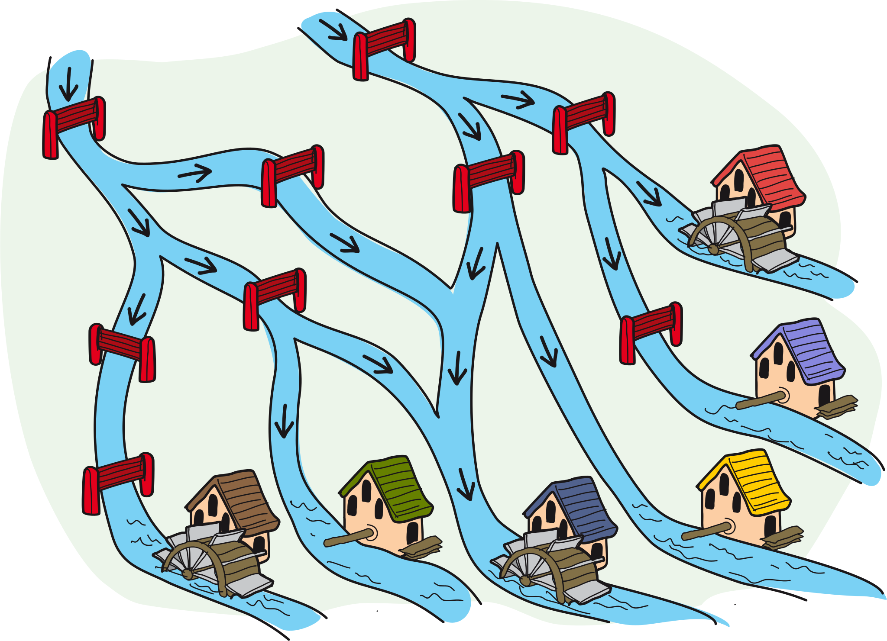

## Body

Le meunier Max a six moulins. Il doit encore fixer la roue de trois d'entre eux. Pour cela, il doit empêcher l'eau d'arriver à ces moulins. L'eau doit par contre continuer de couler jusqu'aux autres moulins.

L'eau ne peut couler que vers le bas. Un clapet fermé empêche l'eau de couler.

## Question/Challenge - for the brochures

Quels clapets faut-il fermer?

## Question/Challenge - for the online challenge

Clique sur les clapets qu'il faut fermer. Clique à nouveau pour les rouvrir.

## Answer Options/Interactivity Description

<!-- empty -->

:::comment
Die Schieber können einzeln angeklickt werden und ändern den Status "mit gelbem Rand" auf "ohne gelbem Rand".
Der Wasserfluss wird nicht interaktiv angepasst.
:::

## Answer Explanation

La bonne réponse est qu'il faut fermer les trois clapets qui sont nommés D, F et H dans le dessin suivant.

C'est la seule possibilité permettant de couper l'eau aux moulins 2, 4 et 5 tout en continuer d'alimenter en eau les trois moulins 1, 3 et 6:
  - Les clapets A, G et I doivent rester ouverts, car sinon le moulin 1 n'est pas alimenté en eau.
  - Les clapets B et E doivent également rester ouverts pour que le moulin 6 soit alimenté en eau.
  - Comme les clapets B et E sont ouverts, le clapet H doit être fermé pour éviter que l'eau n'arrive au moulin 5.
  - Comme le clapet A est ouvert, le clapet F doit être fermé pour éviter que l'eau n'arrive au moulin 2.
  - Comme le clapet B est ouvert, le clapet D doit être fermé pour éviter que l'eau n'arrive au moulin 4.
  - Comme les clapets D et F sont fermés, le clapet C doit être ouvert pour que le moulin 3 soit alimenté en eau.

## It's Informatics

Dans cet exercice, l'écoulement de l'eau est régulé par des _conditions_. Par exemple, l'eau ne coule jusqu'au moulin 6 que si les deux clapets B et E sont ouverts. Voici un autre exemple un peu plus complexe: l'eau ne coule jusqu'au moulin 3 que si au moins l'une des deux ou les deux conditions suivantes sont remplies:
- Le clapet A est ouvert et l'un des deux clapets C ou F est ouvert.
- Les deux clapets B et D sont ouverts.

De telles combinaisons de conditions sont obtenues à l'aide des _opérateurs logiques_ ET (symbolisé par $\wedge$) ou OU (symbolisé par $\vee$). De tels opérateurs connectent des valeurs de vérité comme vrai et faux. Si A et B sont deux valeurs de vérité, on peut indiquer quelles valeurs de vérité les expressions "A ET B" et "A OU B" ont en fonction de A et B:

:::center
|   A    |   B    | A ET B  |  A OU B  |
| :----: | :----: | :-----: | :------: |
|  faux  |  faux  |  faux   |   faux   |
|  vrai  |  faux  |  faux   |   vrai   |
|  faux  |  vrai  |  faux   |   vrai   |
|  vrai  |  vrai  |  vrai   |   vrai   |
:::

En informatique (et en mathématiques), l'expression "A OU B" est donc aussi considérée comme juste si A et B sont les deux justes.
L'affirmation "le moulin 6 est alimenté" est équivalente à:

:::indent
"le clapet B est ouvert" ET "le clapet E est ouvert".
:::

Dans le deuxième exemple, l'affirmation "le moulin 3 est alimenté" est équivalente à:

:::indent
("le clapet A et ouvert" ET ("le clapet C est ouvert" OU "le clapet F est ouvert")) OU ("le clapet B est ouvert" ET "le clapet D est ouvert").
:::

En programmation, il est important de formuler les conditions de manière exacte. 
Chaque ET et chaque OU combine deux affirmations. Les parenthèses déterminent dans quel ordre les affirmations sont combinées.
Les combinaisons à l'aide d'opérateurs logiques et de parenthèses sont utiles pour formuler des conditions complexes. Des conditions sont utilisées aussi bien pour des branchements avec `if` que pour des boucles `while` afin de guider le déroulement d'un programme.

## Keywords and Websites

 - Instruction conditionnelle: https://fr.wikipedia.org/wiki/Instruction_conditionnelle_(programmation)
 - Variable booléenne: https://fr.wikipedia.org/wiki/Booléen
 - Algèbre de Boole: https://fr.wikipedia.org/wiki/Algèbre_de_Boole_(logique)

## Wording and Phrases

(Not reported from original file)

## Comments

(Not reported from original file)
