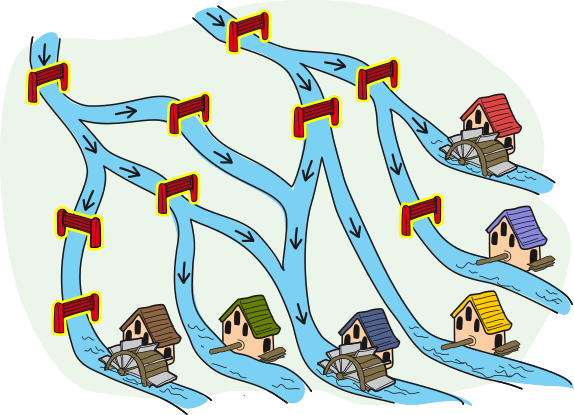

## Body

Mert il mugnaio ha sei mulini. Deve ancora installare la ruota del mulino in tre di loro. Per fare questo, deve fermare il flusso della corrente verso questi mulini. Ma l'acqua dovrebbe continuare a scorrere verso gli altri mulini.

L'acqua può scorrere solo verso il basso. Una valvola a scorrimento chiusa ferma l'acqua.

## Question/Challenge - for the brochures

Quale valvola dovrebbe chiudere Mert?

## Question/Challenge - for the online challenge

Quale valvola dovrebbe chiudere Mert? Clicca sulle valvole per selezionarle. Clicca di nuovo per deselezionarle.

## Answer Options/Interactivity Description

<!-- empty -->

:::comment
Die Schieber können einzeln angeklickt werden und ändern den Status "mit gelbem Rand" auf "ohne gelbem Rand".
Der Wasserfluss wird nicht interaktiv angepasst.
:::

## Answer Explanation

La risposta corretta è: Ci sono tre valvole da chiudere, che sono state etichettate D, F e H nel seguente disegno.

Questo è l'unico modo per fermare il flusso d'acqua ai mulini 2, 4 e 5 senza una ruota del mulino, mentre i mulini 1, 3 e 6 continuano a ricevere acqua:

  - Le vaolvole A, G e I devono rimanere tutte aperte, altrimenti non scorrerebbe più acqua al mulino 1.
  - Anche le valvole B ed E devono rimanere aperte, altrimenti non scorrerebbe più acqua al mulino 6.
  - Poiché le valvole B ed E rimangono aperte, la valvola H deve essere chiusa, altrimenti l'acqua fluirebbe nel mulino 5.
  - Poiché la valvola A rimane aperta, la valvola F deve essere chiusa, altrimenti l'acqua fluirebbe nel mulino 2.
  - Poiché la valvola B rimane aperta, la valvola D deve essere chiusa, altrimenti l'acqua fluirebbe nel mulino 4.
  - Poiché le valvole D e F sono chiuse, la valvola C deve rimanere aperta, altrimenti non ci sarebbe più acqua nel mulino 3.

## It's Informatics

In questo compito, il flusso dell'acqua è controllato dalle _condizioni_. Per esempio, l'acqua scorre al mulino sul fiume 6 quando entrambe le valvole B ed E sono aperte. Ed ecco un secondo esempio un po' più complicato: l'acqua scorre al mulino 3 esattamente quando almeno una o entrambe le seguenti condizioni sono soddisfatte:
- La valvola A è aperta e una delle due valvole C o F è aperta.
- Entrambe le valvole B e D sono aperte.

Tali condizioni composte si ottengono con gli operatori logici AND (come simbolo: $\wedge$) o OR (come simbolo: $\vee$). Tali operatori collegano valori di verità come vero o falso. Così, se A e B sono due valori di verità, si può indicare quali valori di verità hanno le espressioni composte "A AND B" o "A OR B":

:::center
|   A    |   B    |  A AND B  |  A OR B   |
| :----: | :----: | :-----:   | :------:  | 
| falso  | falso  |   falso   |  falso    |
|  vero  | falso  |   falso   |   vero    |
| falso  |  vero  |   falso   |   vero    |
|  vero  |  vero  |    vero   |   vero    |
:::

Nell'informatica (e anche nella matematica), l'affermazione "A OR B" è quindi considerata corretta anche se sia A che B sono veri.
L'affermazione "L'acqua scorre verso il mulino 6" è equivalente a:

:::indent
"la valvola B è aperta" AND "la valvola E è aperta".
:::

Nel secondo esempio, l'affermazione "L'acqua scorre verso il mulino 3" è equivalente a:

:::indent
("la valvola A è aperta" AND ("la valvola C è aperta" OR "la valvola F è aperta")) OR ("la valvola B è aperta" AND "la valvola D è aperta").
:::

Quando si programma, è importante formulare correttamente le condizioni. I collegamenti con gli operatori logici sono utili qui per formulare condizioni più complesse. Sia nella selezione (ramificazione con l'aiuto di `if`) che nell'iterazione condizionale (ciclo `while`), le condizioni sono usate per controllare il flusso del programma.

## Keywords and Websites

 - Selezione, struttura condizionale: https://it.wikipedia.org/wiki/Selezione_(informatica)
 - Variabile booleana: https://it.wikipedia.org/wiki/Variabile_booleana 
 - Operatori booleani: https://it.wikipedia.org/wiki/Algebra_di_Boole

## Wording and Phrases

(Not reported from original file)

## Comments

(Not reported from original file)
