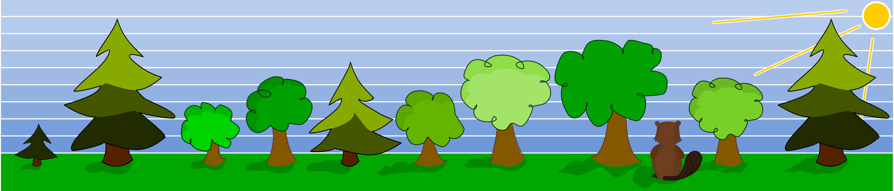
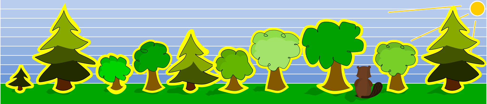
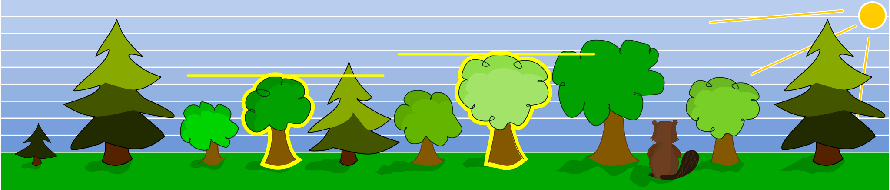

## Body

Ein Biber möchte einen Damm bauen. Damit er immer die richtigen Bäume fällt, hat er sich zwei Bedingungen überlegt: 

Er fällt einen Baum nur dann, wenn ...
- ... direkt links daneben ein kleinerer Baum wächst und ...
- ... direkt rechts daneben ein grösserer Baum wächst.
  
## Question/Challenge - for the brochures

Welche Bäume wird der Biber fällen?

## Question/Challenge - for the online challenge

Welche Bäume wird der Biber fällen? Klicke sie an. Klicke noch einmal, um sie wieder abzuwählen.

## Answer Options/Interactivity Description

<!-- empty -->

:::comment
The student should be able to click (toggle) every single tree. The selection should be saved while switching tasks. When finished the student has to save(commit) to the result.
:::

## Answer Explanation

Nur die Bäume an vierter Stelle und siebter Stelle erfüllen die vorgegebenen Bedingungen: Direkt links befindet sich ein kleiner Baum UND direkt rechts ein grösserer Baum.

## It's Informatics

In der Informatik geht es oft darum, Probleme zu lösen, die durch eine Reihe von logischen _Einschränkungen_ (engl. _constraints_) spezifiziert sind. Die Aufgabe besteht darin, eine Lösung zu finden, die alle gegebenen Einschränkungen erfüllt. Komplexere Aufgaben als diese können behandelt werden, indem die Einschränkungen mit Hilfe von _logischen Operatoren_ kombiniert werden. Die Konjunktion ($\wedge$ oder auch UND-Operator) beispielsweise liefert im Ausdruck A $\wedge$ B genau dann "wahr" als Ergebnis, wenn die beiden Einschränkungen ebenfalls wahr sind. In dieser Aufgabe wäre das dann also: "Der Baum links ist kleiner." $\wedge$ "Der Baum rechts ist grösser." Dieses grundlegende Prinzip kommt in nahezu allen Bereichen der Informatik vor, wie beispielsweise bei vielen Sortier-Algorithmen, zum Beispiel dem _Bubble Sort_, hier werden immer mehrere Objekte einer Liste auf gewisse Einschränkungen überprüft, um sie danach, sofern notwendig, an eine andere Position in der Liste zu verschieben. Dieses Prinzip wird solange wiederholt, bis die Liste vollständig sortiert ist.

## Keywords and Websites

 - Algorithmisches Denken (algorhitmic thinking)
 - logische Operatoren: https://de.wikipedia.org/wiki/Logischer_Operator
 - Sortieren: https://sorting.at/
 - Constraint Satisfaction Problem: https://de.wikipedia.org/wiki/Constraint-Satisfaction-Problem

 
## Wording and Phrases

(Not reported from original file)

## Comments

(Not reported from original file)
