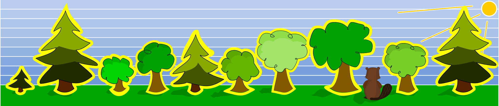

## Body

Un castor aimerait construire un barrage. Afin de toujours abattre les bons arbres, il s'est fixé deux règles. Il n'abat un arbre que si:
- un arbre plus petit pousse directement à sa gauche et
- un arbre plus grand pousse directement à sa droite.

## Question/Challenge - for the brochures

Quels arbres le castor va-t-il abattre?

## Question/Challenge - for the online challenge

Clique sur les arbres que le castor va abattre. Clique à nouveau pour les désélectionner.

## Answer Options/Interactivity Description

<!-- empty -->

:::comment
The student should be able to click (toggle) every single tree. The selection should be saved while switching tasks. When finished the student has to save(commit) to the result.
:::

## Answer Explanation

Seuls les arbres à la quatrième et septième positions remplissent les conditions données: il y a un arbre plus petit directement à gauche ET un arbre plus grand directement à droite.

## It's Informatics

En informatique, il faut souvent résoudre des problèmes qui sont spécifiés par une série de _contraintes_ logiques. La tâche consiste à trouver une solution qui respecte toutes les contraintes. Des problème plus complexes que celui-ci peuvent être résolus en utilisant des _opérateurs logiques_ pour combiner les contraintes. La conjonction ($\wedge$ ou encore opérateur ET) donne par exemple le résultat "vrai" pour l'expression A $\wedge$ B lorsque les deux contraintes A et B sont vraies. Dans cet exercice, ce serait donc: "l'arbre de gauche est plus petit" $\wedge$ "l'arbre de droite est plus grand". On retrouve ce principe fondamental dans presque tous les domaines de l'informatique, par exemple dans beaucoup d'algorithmes de tri comme le _tri à bulles_ lors duquel la satisfaction aux contraintes de plusieurs objets d'une liste est évaluée avant de les déplacer, si nécessaire, à une autre position. Ce procédé est répété jusqu'à ce que la liste soit complètement triée.

## Keywords and Websites

 - Pensée algorithmique (_algorithmic thinking_)
 - Opérateur logique: https://fr.wikipedia.org/wiki/Connecteur_logique
 - Tri à bulles: https://fr.wikipedia.org/wiki/Tri_à_bulles
 - Tri: https://sorting.at/
 - Problème de satisfaction de contraintes: https://fr.wikipedia.org/wiki/Problème_de_satisfaction_de_contraintes

 
## Wording and Phrases

(Not reported from original file)

## Comments

(Not reported from original file)
