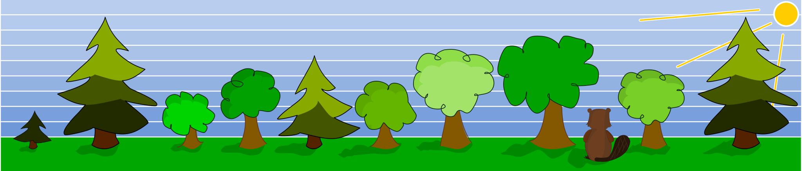
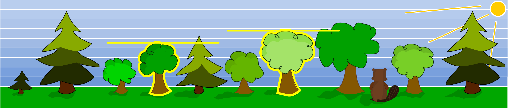

## Body

Un castoro vuole costruire una diga. Per assicurarsi di tagliare sempre gli alberi giusti ha pensato a due condizioni. Ha deciso di tagliare un albero solo se
- un albero più piccolo cresce direttamente a sinistra di esso e
- un albero più grande cresce direttamente alla sua destra.

## Question/Challenge - for the brochures

Quali alberi taglierà il castoro?

## Question/Challenge - for the online challenge

Quali alberi taglierà il castoro? Clicca su di loro. Clicca di nuovo per deselezionarli.

## Answer Options/Interactivity Description

<!-- empty -->

:::comment
The student should be able to click (toggle) every single tree. The selection should be saved while switching tasks. When finished the student has to save(commit) to the result.
:::

## Answer Explanation

Solo gli alberi al quarto e settimo posto soddisfano le condizioni date: c'è un piccolo albero direttamente sulla sinistra E un albero più grande direttamente sulla destra.

## It's Informatics

In informatica il compito è spesso quello di risolvere problemi che sono specificati da un insieme di vincoli logici. Il compito è quello di trovare una soluzione che soddisfi tutti i vincoli dati. Compiti più complessi di questo possono essere gestiti combinando i vincoli usando gli _operatori logici_. La congiunzione (operatore $\wedge$ o anche AND), per esempio, restituisce "vero" come risultato nell'espressione A $\wedge$ B esattamente quando i due vincoli sono anche veri. In questo compito, questo sarebbe: "l'albero a sinistra è più piccolo" $\wedge$ "l'albero a destra è più grande". Questo principio di base si verifica in quasi tutte le aree dell'informatica, come in molti algoritmi di ordinamento, per esempio il _Bubble Sort_. In questo algoritmo diversi oggetti di una lista sono sempre controllati per certi vincoli, al fine di spostarli successivamente in un'altra posizione della lista. Questo principio viene ripetuto fino a quando la lista è completamente ordinata.

## Keywords and Websites

 - Pensiero algoritmico (algorithmic thinking)
 - Operatori logici: https://it.wikiversity.org/wiki/Operatori_Logici_%28superiori%29
 - Algoritmo di ordinamento: https://it.wikipedia.org/wiki/Algoritmo_di_ordinamento
 - Problema di soddisfacimento di vincoli: https://it.wikipedia.org/wiki/Problema_di_soddisfacimento_di_vincoli

 
## Wording and Phrases

(Not reported from original file)

## Comments

(Not reported from original file)
