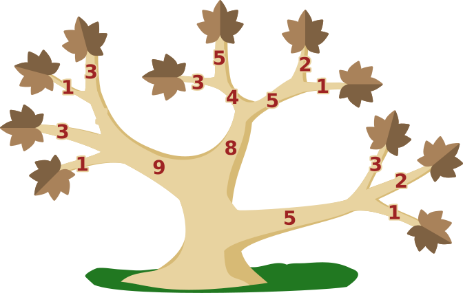
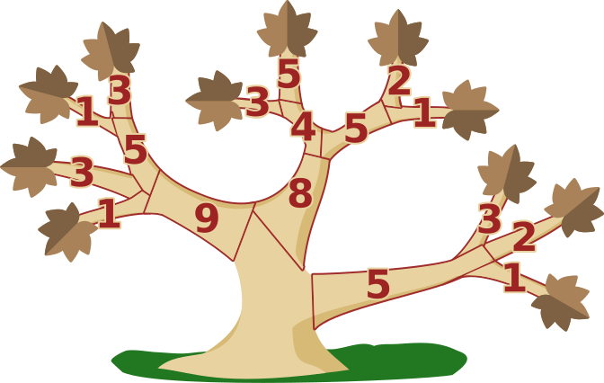
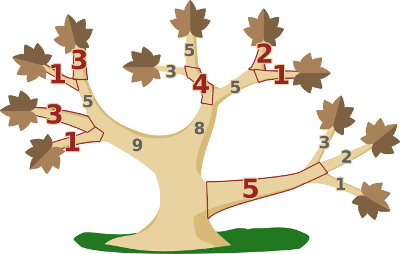

## Body

Ein Baum in Brunos Garten ist krank, alle Blätter sind vertrocknet. Bruno will den Baum retten. Dazu muss er einige Äste absägen, so dass am Ende alle Blätter entfernt sind. Dann können neue Äste mit neuen Blättern wachsen. Bruno möchte so schnell wie möglich fertig sein. 

") 

Das Bild zeigt ein Beispiel: 

Um die beiden Blätter zu entfernen, kann Bruno entweder die beiden Äste mit den Blättern absägen oder nur den einen Ast, von dem die beiden anderen abzweigen.
Die Zahlen geben für jeden Ast an, wie lange das Absägen dauert. Bruno wird also die beiden Äste mit den Blättern absägen, da $3 + 1 < 5$.
Unten siehst du den gesamten Baum.

## Question/Challenge - for the brochures

Welche Äste wird Bruno absägen, um so schnell wie möglich fertig zu sein?

## Question/Challenge - for the online challenge

Welche Äste wird Bruno absägen, um so schnell wie möglich fertig zu sein? Klicke die richtigen Äste an. Klicke noch einmal, um sie wieder abzuwählen.

## Answer Options/Interactivity Description

<!-- empty -->

:::comment
Durch Anklicken wechselt jeder Ast den Status zwischen "ausgewählt" und "nicht ausgewählt". Zu Beginn sind alle Äste "nicht ausgewählt". Ein "ausgewählter" Ast wird gemeinsam mit der zugehörigen Zahl mit den "Schnittkosten" grafisch hervorgehoben. Überflüssiges Auswählen (z. B. gleichzeitig der Ast mit der 5 und der mit der 3 im Beispiel) wird nicht verhindert. Eine Antwort ohne ausgewählten Ast kann zurückgewiesen werden.
:::

## Answer Explanation

So ist es richtig:
Bruno sägt die rot markierten Äste ab, um so schnell wie möglich fertig zu sein:

Aber warum ist das so? Zunächst können wir ausrechnen, wie viel Zeit Bruno benötigt, wenn er nur die Äste mit Blättern absägt – damit wäre er ja fertig:

$$1 + 3 + 1 + 3 + 3 + 5 + 2 + 1 + 3 + 2 + 1 = 25$$

Nun gehen wir in Richtung Stamm weiter und überlegen immer wieder neu, ob es schneller sein könnte, den Ast abzusägen, von dem die bisherigen Äste direkt oder indirekt abzweigen.
Nach dem ersten solchen Schritt ergibt sich die folgende Rechnung (die Funktion "min" berechnet das Minimum ihrer Argumente):

$$\begin{aligned}
    &1 + 3 + \min(5, 1 + 3) + \min(4, 3 + 5) + \min(5, 2 + 1) + \min(5, 3 + 2 + 1)\\
={} &1 + 3 + (1 + 3) + 4 + (2 + 1) + 5\\
={} &20
\end{aligned}$$

Dabei rechnen wir die Gesamtzeit zuerst noch nicht aus, damit wir besser sehen, welche Äste abzusägen sind. Nach dem nächsten Schritt sind wir schon am Stamm angekommen: 

$$\begin{aligned}
    &\min(9, 1 + 3 + 1 + 3) + \min(8, 4 + 2 + 1) + 5\\
={} &(1 + 3 + 1 + 3) + (4 + 2+ 1) + 5\\
={} &20
\end{aligned}$$

Schneller kann Bruno nicht fertig sein.

## It's Informatics

Stellen wir uns einmal vor, die abgesägten Stücke von Brunos Baum würden nicht direkt auf die Erde fallen – so wie beim Lösen dieser Biberaufgabe am Bildschirm. Dann könnte man sagen, dass der Baum durch das Absägen in nur zwei Teile zerlegt wird: Der eine Teil enthält alle abgesägten Stücke, insbesondere also alle Blätter, und der andere Teil enthält den Stamm und alle davon ausgehenden Äste bis zu den Sägestellen. Diese Zweiteilung bzw. dieser _Schnitt_ durch den Baum ist minimal in Bezug auf die Zeit, die Bruno fürs Absägen aufbringen muss.

Auch die Informatik kennt Bäume und verwendet sie zur Darstellung von Objekten, die auf bestimmte Weise miteinander verbunden sind. Die Objekte werden als _Knoten_ bezeichnet, die Verbindungen als _Kanten_. Dabei gibt es zwischen zwei Knoten immer nur einen Weg entlang der Kanten – so wie es im echten Baum von einem Blatt oder einer Astgabelung immer nur einen Weg entlang der Äste zum Stamm gibt. Verzichtet man auf diese Bedingung, ist allgemeiner von einem _Graphen_ die Rede.

In einem allgemeinen Graphen ist ein _minimaler Schnitt_, also die Zerlegung in zwei oder auch mehrere Teile mit minimalen Kosten, nicht so einfach zu berechnen, wie wir es hier für einen Baum vorgemacht haben, aber auch nicht allzu schwierig. Das ist gut, denn es gibt interessante Anwendungen. Minimale Schnitte können etwa bei der Zerlegung von Bilddateien in ähnliche Teile verwendet werden. In speziellen Graphen, den _Flussnetzen_, mit denen unter anderem Datenflüsse durch Netzwerke modelliert werden können, entsprechen die Kosten eines minimalen Schnitts dem maximal möglichen Fluss durch das gesamte Netz.

## Keywords and Websites

 - Baum: https://de.wikipedia.org/wiki/Baum_(Graphentheorie)
 - Schnitt: https://de.wikipedia.org/wiki/Schnitt_(Graphentheorie) 
 - Flüsse und Schnitte in Netzwerken: https://de.wikipedia.org/wiki/Flüsse_und_Schnitte_in_Netzwerken
 - Max-Flow-Min-Cut-Theorem: https://de.wikipedia.org/wiki/Max-Flow-Min-Cut-Theorem

## Wording and Phrases

(Not reported from original file)

## Comments

(Not reported from original file)
