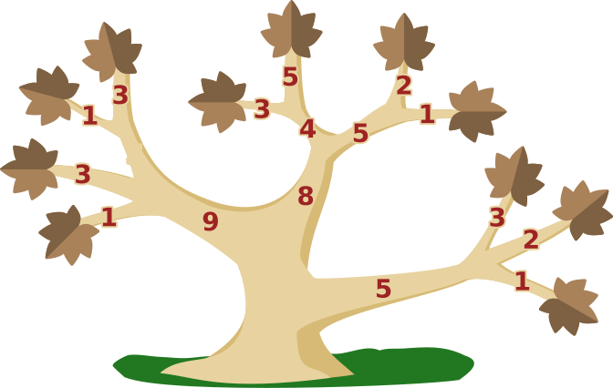
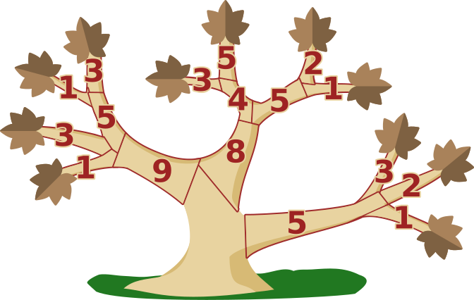

## Body

Un albero nel giardino di Bruno è malato e tutte le foglie si sono seccate. Bruno vuole salvare l'albero. Per farlo, deve segare alcuni rami in modo che alla fine tutte le foglie siano rimosse e che possano crescere nuovi rami con nuove foglie.

")

Bruno vuole finire il prima possibile. L'immagine mostra un esempio:

Per tagliare le due foglie, Bruno può segare i due rami con le foglie o solo il ramo da cui si dipartono gli altri due.
I numeri indicano per ogni ramo quanto tempo ci vuole per il taglio. Bruno segherà quindi i due rami con le foglie, perché $3 + 1 < 5$.
Qui sotto si vede l'intero albero.

## Question/Challenge - for the brochures

Quali rami segherà Bruno per finire il più velocemente possibile?

## Question/Challenge - for the online challenge

Quali rami segherà Bruno per finire il più velocemente possibile? Clicca sui rami giusti. Clicca di nuovo per deselezionarli.

## Answer Options/Interactivity Description

<!-- empty -->

:::comment
Durch Anklicken wechselt jeder Ast den Status zwischen "ausgewählt" und "nicht ausgewählt". Zu Beginn sind alle Äste "nicht ausgewählt". Ein "ausgewählter" Ast wird gemeinsam mit der zugehörigen Zahl mit den "Schnittkosten" grafisch hervorgehoben. Überflüssiges Auswählen (z. B. gleichzeitig der Ast mit der 5 und der mit der 3 im Beispiel) wird nicht verhindert. Eine Antwort ohne ausgewählten Ast kann zurückgewiesen werden.
:::

## Answer Explanation

Questa è la soluzione giusta: 
Bruno sega i rami segnati in rosso per finire il più velocemente possibile:

Ma perché? Prima di tutto, possiamo calcolare di quanto tempo ha bisogno Bruno se sega solo i rami con le foglie:

$$1 + 3 + 1 + 3 + 3 + 5 + 2 + 1 + 3 + 2 + 1 = 25$$

Ora continuiamo verso il tronco e consideriamo se potrebbe essere più veloce segare il ramo da cui dipartono direttamente o indirettamente i rami precedenti.
Dopo il primo di questi passi, il seguente calcolo risulta (la funzione "min" calcola il minimo dei suoi argomenti):

$$\begin{aligned}
    &1 + 3 + \min(5, 1 + 3) + \min(4, 3 + 5) + \min(5, 2 + 1) + \min(5, 3 + 2 + 1)\\
={} &1 + 3 + (1 + 3) + 4 + (2 + 1) + 5\\
={} &20
\end{aligned}$$

All'inizio non calcoliamo il tempo totale, in modo da vedere meglio quali rami devono essere tagliati. Dopo il prossimo passo abbiamo già raggiunto il tronco: 

$$\begin{aligned}
    &\min(9, 1 + 3 + 1 + 3) + \min(8, 4 + 2 + 1) + 5\\
={} &(1 + 3 + 1 + 3) + (4 + 2+ 1) + 5\\
={} &20
\end{aligned}$$

Bruno non può essere più veloce di così. 

## It's Informatics

Immaginiamo che i pezzi segati dell'albero di Bruno non cadano direttamente a terra - come succede quando si risolve questo compito sullo schermo. Allora potremmo dire che l'albero si divide in due sole parti segandolo: Una parte contiene tutti i pezzi segati, cioè in particolare tutte le foglie, e l'altra parte contiene il tronco e tutti i rami che si estendono da esso ai punti di taglio. Questa divisione o _taglio_ attraverso l'albero è minima in termini di tempo che Bruno deve spendere per segare.

Anche l'informatica conosce gli alberi e li usa per rappresentare oggetti che sono collegati tra loro in un certo modo. Gli oggetti sono chiamati _vertici_, le connessioni _archi_. C'è sempre un solo percorso tra due vertici lungo gli archi - proprio come in un albero reale c'è sempre un solo percorso lungo i rami da una foglia o una biforcazione al tronco. Se rinunciamo a questa condizione, si parla più generalmente di un _grafo_.

In un grafo generale, un _taglio minimo_, cioè la scomposizione in due o più parti con costi minimi, non è così facile da calcolare come abbiamo dimostrato qui per un albero, ma non è nemmeno troppo difficile. Questo è un bene, perché ci sono applicazioni interessanti. I tagli minimi possono essere utilizzati, per esempio, nella scomposizione di file di immagini in parti simili. In grafi speciali, le _reti di flusso_, che possono essere utilizzate per modellare i flussi di dati attraverso le reti, tra le altre cose, il costo di un taglio minimo corrisponde al massimo flusso possibile attraverso l'intera rete.

## Keywords and Websites

 - Albero: https://it.wikipedia.org/wiki/Albero_(grafo)
 - Taglio: https://it.wikipedia.org/wiki/Taglio_(teoria_dei_grafi)
 - Rete di flusso: https://it.wikipedia.org/wiki/Rete_di_flusso
 - Teorema del flusso massimo e taglio minimo: https://it.wikipedia.org/wiki/Teorema_del_flusso_massimo_e_taglio_minimo

## Wording and Phrases

(Not reported from original file)

## Comments

(Not reported from original file)
